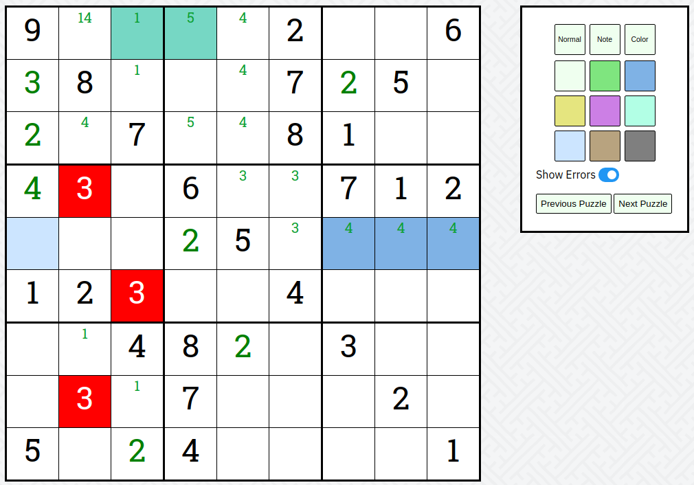

# sudo-ku
A web page for playing sudoku.

# Features
 - Mutliple control schemes
     - Arrow Keys / WASD navigate OR
     - Mouse to move selection 
     - Multi-select with Ctrl + Movement OR
     - Click and drag
     - Space bar toggles Normal / Note / Color OR
     - Hold shift to move to note
     - Enter toggles if a digit is LOCKED. Locking means that the digit cannot be changed.
 - 9 Different colors can be placed as arbitrary markers
 - Toggle error checking
 - Built in puzzles
 - Random puzzle generation
 - Use LOCKING to import your own puzzles

# Demos
Github doesn't suport videos in the README. Checkout the demos folder!
